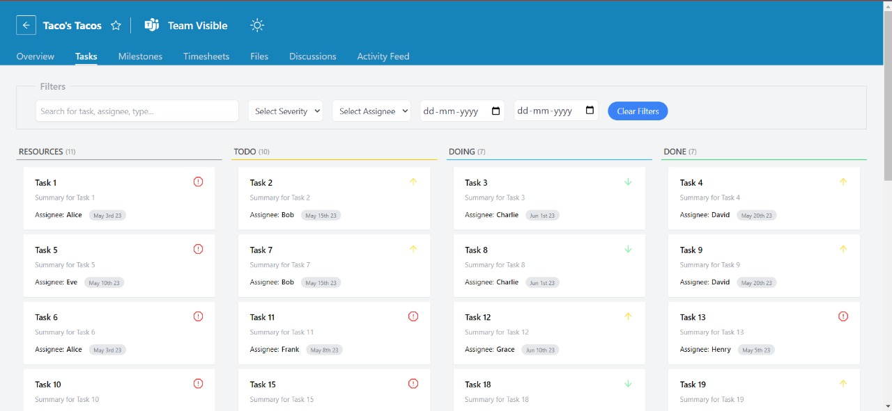
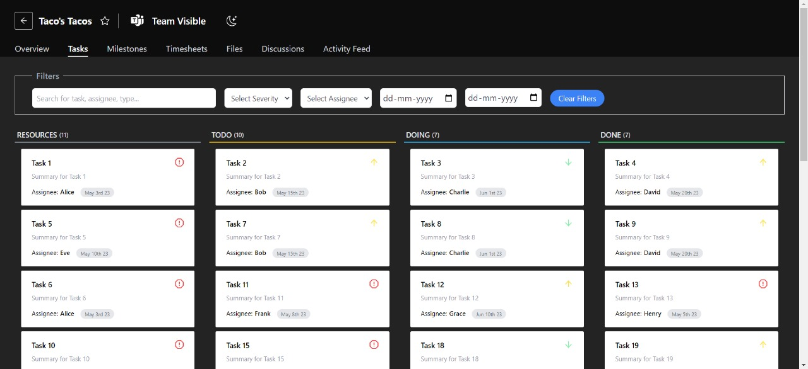

# 🚀 Zuddl Task Board

This is a Trello task Board built using `ReactJs`, `React-Beautiful-Dnd`, `Vite` and `TailwindCSS`.

## Questions
`Question 1.` How would tables & api endpoints updated If a user can create and edit stages for a particular board ? 

:white_check_mark: Table Changes: Let's say if we introduce a new table (eg. working ), to store this stage, the table could have properties like `board_id` ( eg: 5 ),`stage_name` ( which will be: working) & `position` ( to maintain order of stages). 

:white_check_mark: API endpoint changes: we would need some new api endpoints to manage the stages such as \
    - `GET /board/:board_id/stages`: fetch all stages for a specific board. \
    - `POST /board/:board_id/stages`: Create a new stage for a board. \
    - `PUT /board/:board_id/stages/:stage_id`: Update the properties of a specific stage.\
    - `DELETE /board/:board_id/stages/:stage_id`: Delete a stage from a board.

`Question 2.` How would tables & api endpoints updated If users can comment on tasks ?

:white_check_mark: Table changes: Table may not have significant changes but the `Task Card` would have input field to comment on that particular task for which a `POST` api request would be made & get stored in the comments properties of that particular task.

:white_check_mark: API endpoint changes: we would need to some new api endpoints to create, read, update & delete ( CRUD ) the comments, such as:\
    - `GET /task/:task_id/comments`: Retrieve all comments for a specific task. \
    - `POST /task/:task_id/comment`: Create a new comment for a task. \
    - `PUT /task/:task_id/comments/:comment_id`: Update the comment of a specific task.\
    - `DELETE /task/:task_id/comments/:comment_id`: Delete a comment from a task.

`Question 3.` How will you do error handling?

- `Validation`: Implement real-time validaotion for user inputs. Example, if a user tries to create a task with an  empty title, invalid date or invalid assignee, provide instant feedback by displaying an error message next to it.

- `Error Boundaries`: Use React's Error Boundaries to catch and handle errors that occur within components. We can display a fallback UI and log the error for debugging purposes.

- `Retry Mechanism`: For certain errors we can give a retry method. For example, if a task couldn't be moved due to a network error, provide a button to retry the operation once the network is restored.

- `Testing`: Perform automated testing, including unit tests and integration tests, to catch and address potential errors before they reach users.

- `Loading Spinners`: Show loading spinner while waiting for the response from the server during actions like moving a task or updating a task. Show error message by replacing loader if request is failed.

## 📸 Screenshots

## 👨‍💻 Demo

Try out the website : [Zuddl Task Board](https://zuddl-task-board.vercel.app//)

## 👨‍🔧 Tech Stack

## 👨‍💻 Features

:white_check_mark: Implemented Task Board layout.\
:white_check_mark: Drag-and-Drop of Task Cards.\
:white_check_mark: Metrics like: number of tasks, people involved, effort spent on all tasks.\
:white_check_mark: search functionality, which will search by task name from any group (Ready/In progress/Testing/Done).\
:white_check_mark: Filters like filter by Start/End dates, filter by assignee, filter by severity of the task.\
:white_check_mark: unique colors / badges to each task based on severity (High/Medium/Low).\
:white_check_mark: Implemented light and dark mode theme.\
:white_check_mark: Fetched tasks from a mock api.\
:white_check_mark: Responsive design using tailwind CSS styling.\
:white_check_mark: Implemented Shimmer UI for the initial paint of the webpage.

## 🪜 Steps I took to optimize the page load time

- Used code-splitting with `React.Lazy()` and `Suspense` to lazy load the components.
- Used `React.Memo()` to optimize the render performance of functional components.
- Used vercel to deploy this website to leverage its Vercel Edge Network compression that results in the better performance.

## Available Scripts

In the project directory, you can run:

### `npm run dev`

Runs the app in the development mode.\
Open [http://localhost:5173](http://localhost:5173) to view it in the browser.
